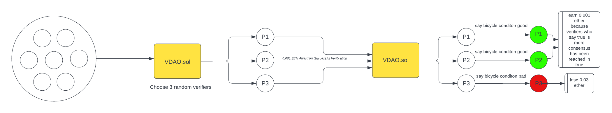
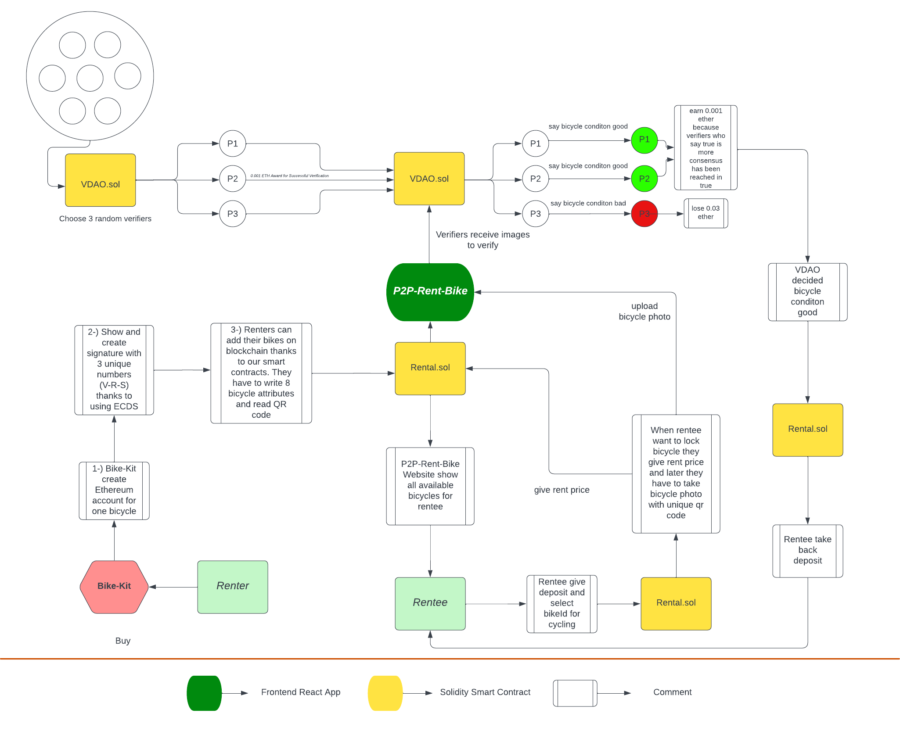

# P2P Bike Rent

Rent other people's bikes. Stay anonymous, help the urbanism movement. Join VDAO, stake and start earning with "verify2earn"! Not using your bike currently? - Earn extra crypto
 
**P2P Bike Rent provides an opportunity for users to rent bikes without providing any personal data. It
also allows people to share their bikes and earn money. Lastly, it allows people to earn extra income by joining the Validator Network and Verify2Earn**

[Rental Contract](https://rinkeby.etherscan.io/address/0x912c973E6A3DAdaee3FBDe072052d627Ece6829B).
 
[VDAO Contract](https://rinkeby.etherscan.io/address/0x07980Fae9E884c5C72C98cBDf40e0aD70739FFac).  
[P2P-Rent-Bicycle-Website](https://p2p-bike-rental.vercel.app/quickstart).  

​

## Introduction

## Bike-Kit

​
To Start, Rentors should first buy a bike-kit, a custom hardware that includes led screen and gps and a automatic locker. The screen will be used to generate randomized qr codes [QRCodes](https://github.com/BilkentCrypto/p2p-bike-rental/tree/qrcode-scanner/QR_Code_Scanner)  
Upon opening the kit, the kit creates an Ethereum address and generates 3 unique numbers from this private key
(V-R-S) using ECDS. The reason we use this method is because the owner of the bike should not know the private key of the bike/kit's account [ECDS](https://github.com/BilkentCrypto/p2p-bike-rental/tree/signed-message-verifier/SignedMessageVerifier).
​

## Rentor

​
Rentor nteracts with the smart contract and adds the V-R-S values, the bike model,
the year of the bike model, bike's account,the price of the bike and the price per minute of the bike [Rental](src/contract/Rental.sol).
​

## Renteer/Rentee

​
A bike rentee can see all the available bikes and the features of these bikes in the area.
In order to rent the selected bike, a certain amount (i.e. ~deposit), equal to the bike's value, is locked in the system as stake
(Precaution in case the bike is stolen or damaged, decision done by VDAO). if(!problemwiththeBike) -> lock is opened but unstake is optional.
The fee for the ride is taken according to the time of use. Can be static (default value) or (feature) set by the rentor.[Rental](src/contract/Rental.sol).
​

## VDAO (Verifer DAO)

​
We developed VDAO because it is necessary to prevent the renter from causing any damage to the bike (and worse, get away with it). Furthermore, the system that controls/makes the decisions about returned bikes and their XP status must be decentralized.  
The rentee takes a photo of the bike, submits it to the system. The files are stored in IPFS and the links are sent to VDAO [VDAO](src/contract/VDAO.sol). The smart contract randomly chooses the validators. Validators can be
included in the system by staking 0.1 ether for now. After receiving a "validate" notification, validator checks if the bicycle has any problems comparing it with a previous photo. Upon verification, 80% the renter's money is sent to the owner of the bike,[Rental](src/contract/Rental.sol) 20% are transferred to the stake pool and distributed to the validators.  
Lastly, those who answer incorrectly are punished with a serious penalty ~ 30% cut. 
​

## P2P-Bike-Rent Diagram

​

​

## RoadMap

### Rentee

-Loyalties/Perks: The amount of deposit paid by users who earned trust (ex. no record of damage) of the system will be reduced.
-The damage isn't black and white! Depending to the damage to the bike, you won't have to give the full deposit (the VDAO system will be furthermore developed).

### VDAO

-Approvers will see four options: no damage, slight, medium and heavy damage.
